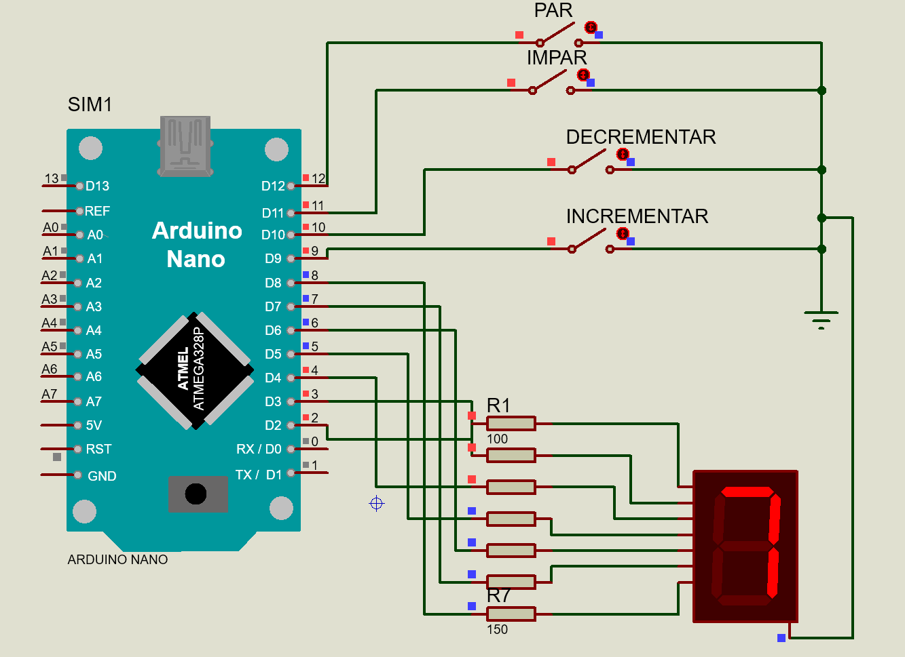

# Arduino-7-Segment-Display-Control
This project demonstrates how to control a 7-segment display with Arduino using modular, scalable, and optimized code. It supports interaction via buttons to increment, decrement, and adjust displayed values.

## Features

- Increment and decrement displayed value with buttons.
- Adjust displayed value to the nearest even or odd number.
- Modular and reusable functions for scalability.
- Optimized for performance and ease of maintenance.

## Circuit Diagram



## Getting Started

1. Clone this repository:
   ```bash
   git clone https://github.com/your-username/Arduino-7-Segment-Display-Control.git